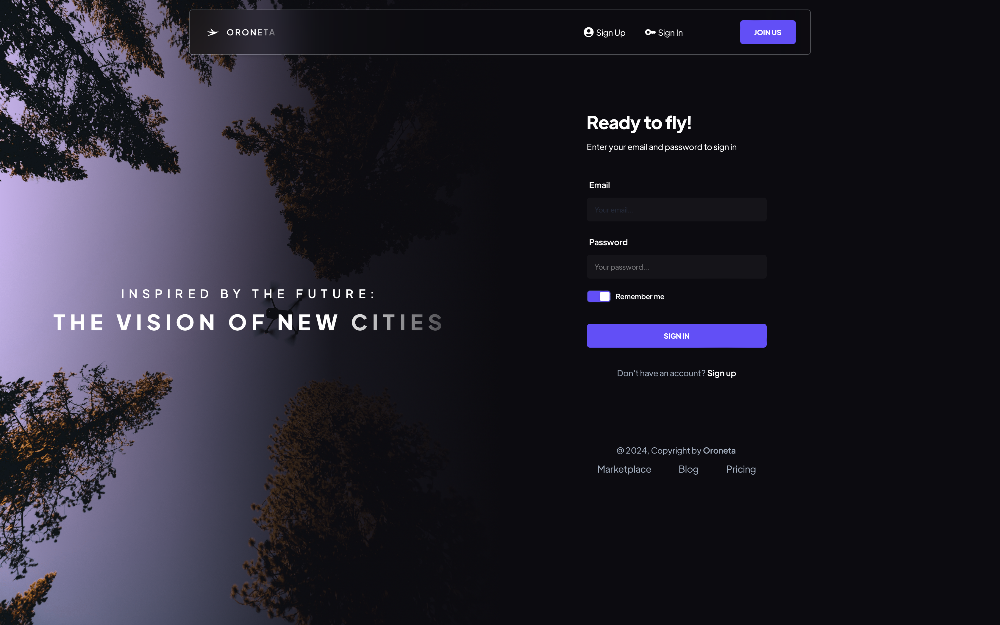
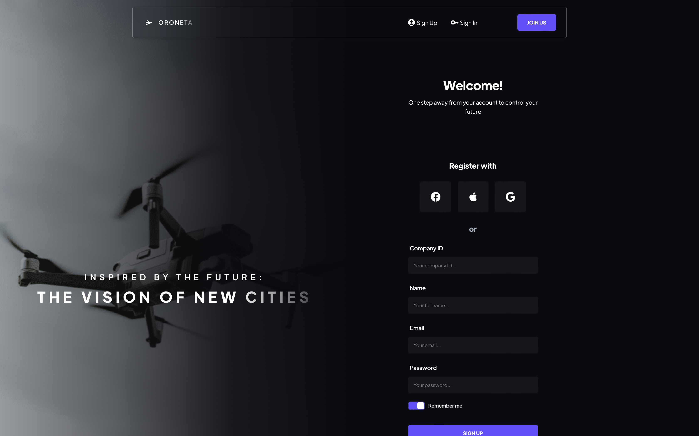
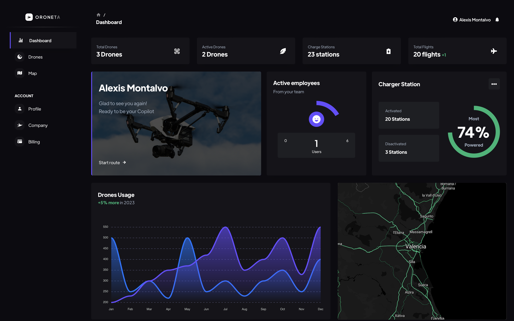
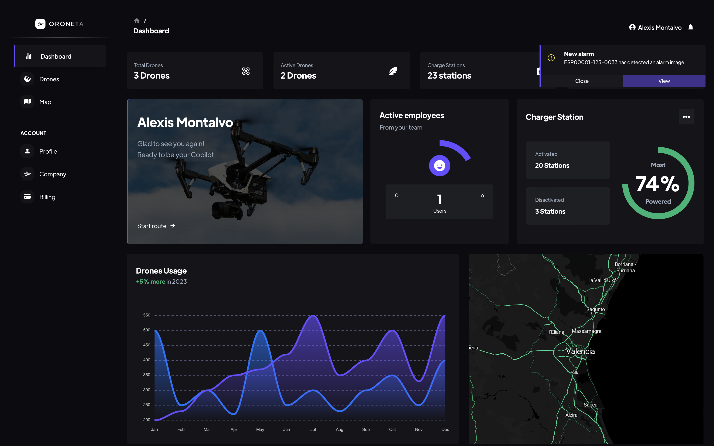
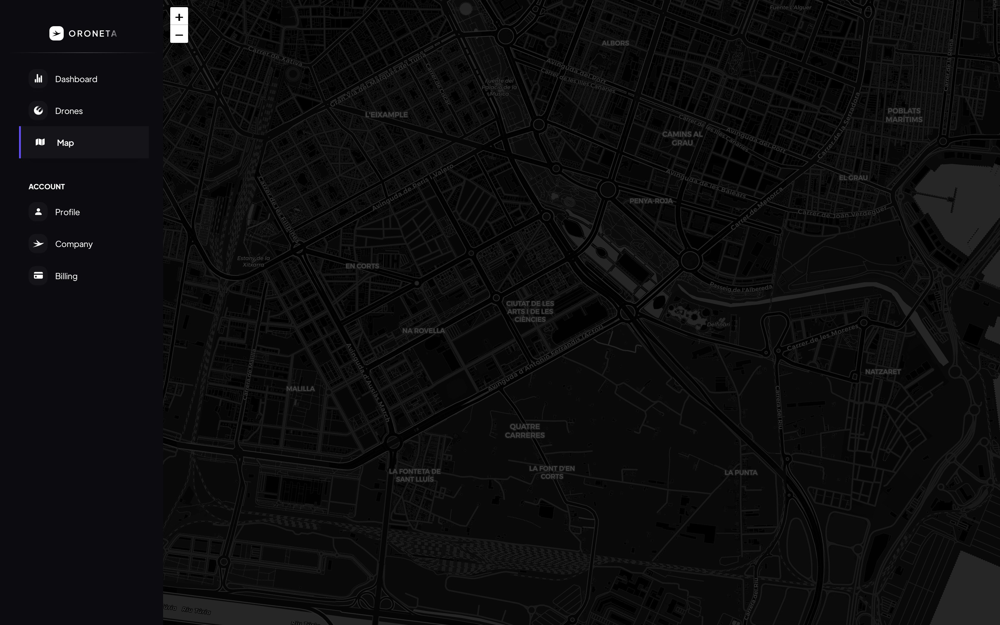
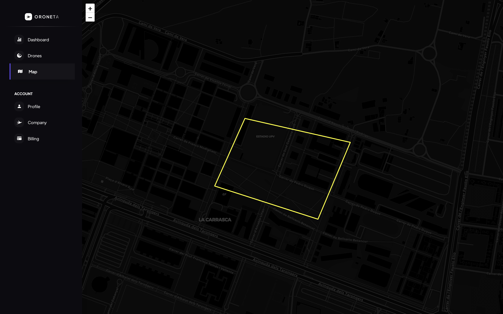
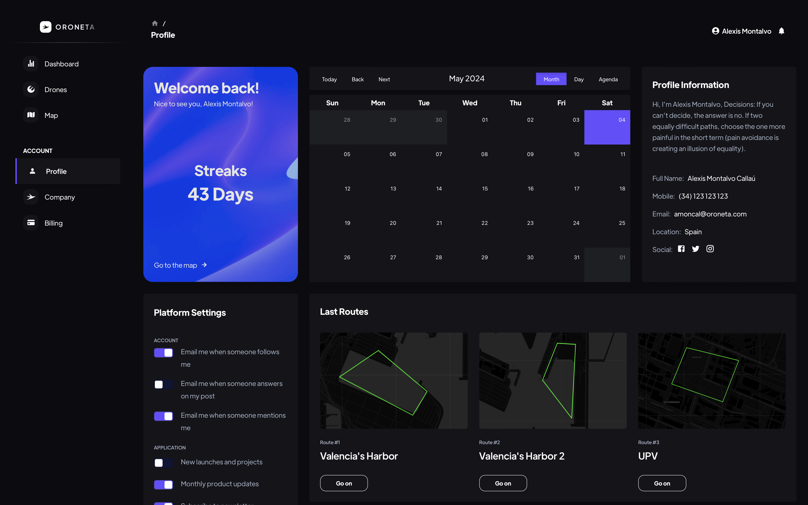
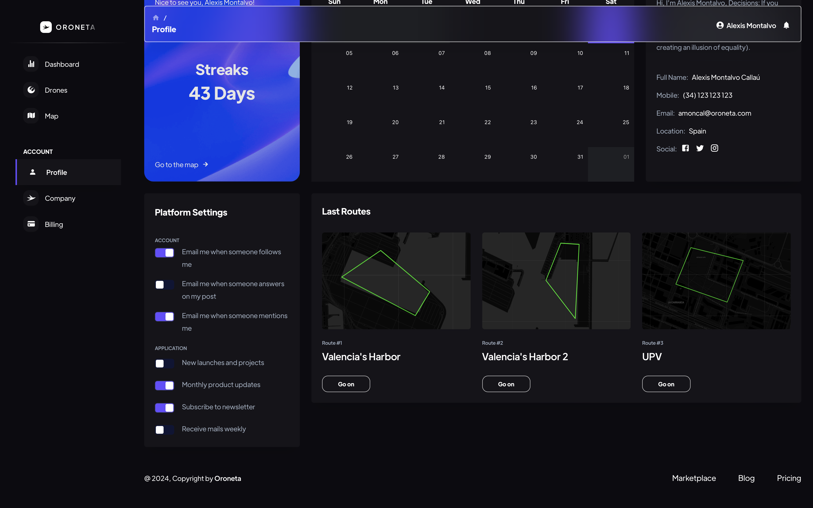
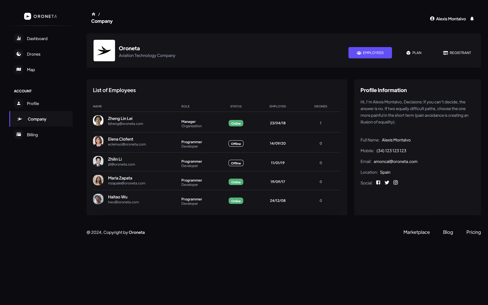
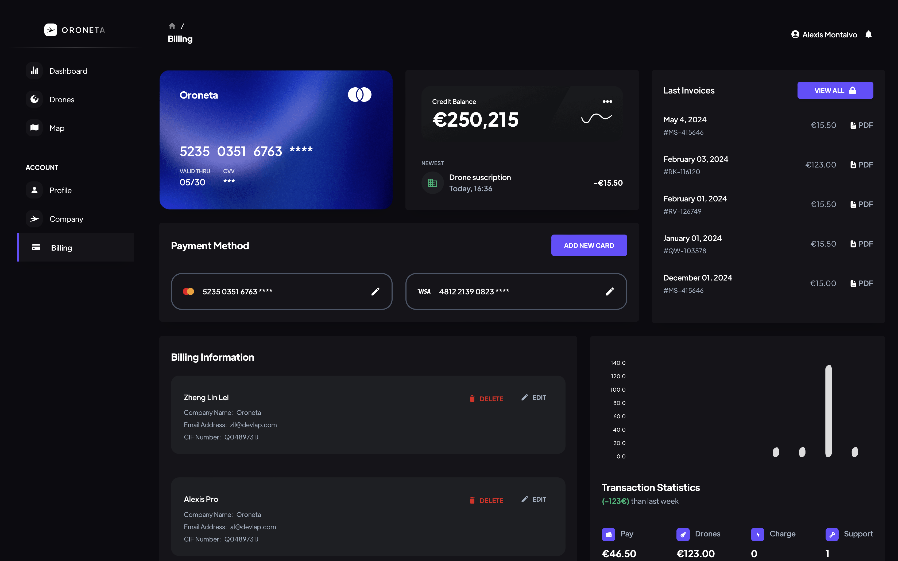

<h1 align="center">Template front of Oroneta Project</h1>
<br>
<br>

<p align="center">
  <i>Client side </i>
</p>

<p align="center">
  <a href="./CONTRIBUTING.md">Contributing</a>
  ·
  <a href="https://github.com/oroneta/drone-front/issues">Issues</a>
</p>

<p align="center">
  <a href="https://opensource.org/">
    
  </a>&nbsp;
  <a>
    
  </a>
</p>

<hr>

## Table of Contents

- [Introduction](#introduction)
- [Examples](#examples)
- [Installation](#installation)
- [Execution](#execution)
- [Testing](#testing)

## Introduction

This is the front-end of the Oroneta project. This project is a web application that allows you to manage drones, routes, and registrants. This project is part of the Oroneta project, which is a project that aims to create a drone delivery system.

## Examples

Sign in page:



Sign up page:



Dashboard page:





Drones page:


Map page:





Profile page:





Company page:



Billing page:




## Installation

To install the project, you need to clone the repository and install the dependencies. You can do this by running the following commands:

```bash
git clone https://github.com/oroneta/drone-front.git
cd drone-front
```

## Execution

To run the project as prod, you need to run the following command:

```bash
cd docker
docker compose up -d --build
```

If you want to run the project as dev, you need to modify the `./docker/.env` file and set:

```conf
SERVER_ENV = pro # Or set to dev
```

And then run the following command:

```bash
cd docker
docker compose up -d --build --force-recreate --remove-orphans
```

## Testing

Access to `localhost:80` or `localhost` to see the project running.

```bash
nc -zv localhost 80
```


## License

This project is licensed under the Apache 2.0 License - see the [LICENSE](./LICENSE) file for details.

Any of this project's code can be used for non-commercial purposes. Any other use must be approved by the project owner.

All rights reserved to Oroneta Project.
